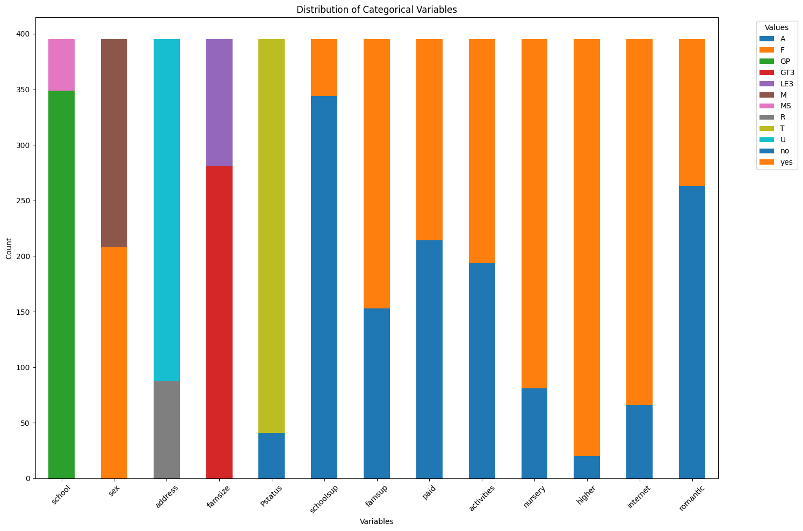

# AI-Based Grade Prediction


[](https://creativecommons.org/licenses/by/4.0/)
[](https://www.python.org/downloads/release/python-380/)
[](https://streamlit.io/)

## Problem Statement
Build a model to predict a student’s final grade based on features such as attendance, participation, assignment scores, and exam marks.

## Approach
1. **Data Collection**: Utilized the Student Performance Dataset from the UCI Machine Learning Repository.
2. **Data Preprocessing**: Cleaned and processed the data to handle categorical variables.
3. **Model Training**: Trained an Artificial Neural Network(ANN) for regression.
4. **Evaluation**: Evaluated models using RMSE and classification metrics like accuracy.
5. **Feature Analysis**: Analyzed feature importance to identify key contributors to performance.



6. **Productization**: Developed a Streamlit web app for user interaction.

## Results
- **Model Performance**:
$$
\text{Accuracy} = \frac{\text{Number of Correct Predictions}}{\text{Total Number of Predictions}}
$$

&nbsp;

$$
\text{RMSE} = \sqrt{\frac{1}{n} \sum_{i=1}^{n} (y_i - \hat{y}_i)^2}
$$
    - ANN Model: RMSE = 0.2576

## Challenges
- **Feature Engineering**: Created new features to improve model performance.
- **Model Overfitting**: Implemented regularization techniques to mitigate overfitting.

## Installation
1. Clone the repository:
    ```bash
        git clone https://github.com/messi10tom/AI-Based-Grade-Prediction.git
        cd AI-Based-Grade-Prediction
    ```
2. Create and activate a virtual environment:
    ```bash
        python3 -m venv venv
        source venv/bin/activate
    ```
3. Install the required packages:
    ```bash
        pip install -r requirements.txt
    ```

## Usage

1. **Running the Web App**:
    ```bash
        streamlit run src/app.py
    ```


## Screenshots
### Training logs


## License
This project is licensed under the Creative Commons Attribution 4.0 International (CC BY 4.0). See the [LICENSE](LICENSE) file for details.

---

For further details, visit the [dataset page on UCI Machine Learning Repository](https://archive.ics.uci.edu/ml/datasets/Student+Performance).

